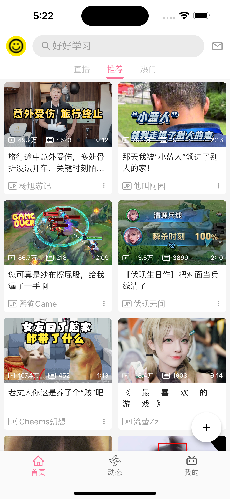
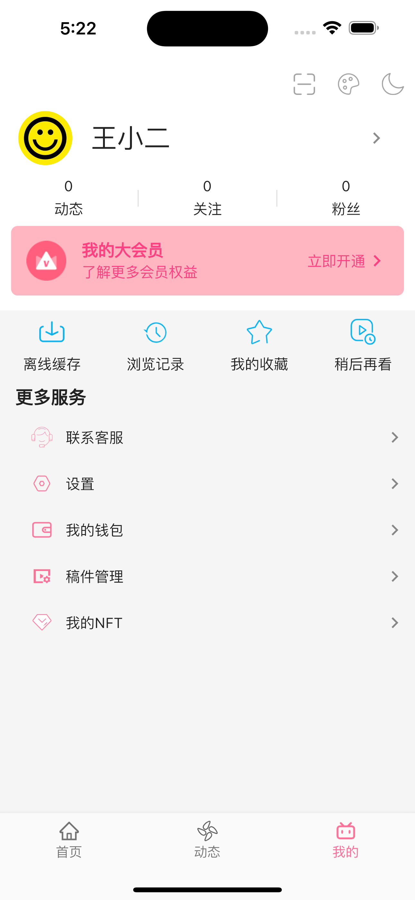

# bilibili_bloc

一个仿哔哩哔哩国际版应用的flutter项目，仅仅是简单绘制了几个界面，但是包含了 `Bloc`、主题色、国际化等。

使用[flutter_gen](https://pub.dev/packages/flutter_gen)来访问本地资源

项目里的数据来源于项目 [bilibili-api](https://github.com/nemo2011/bilibili-api) 的接口调用得到的

**部分截图**

    

